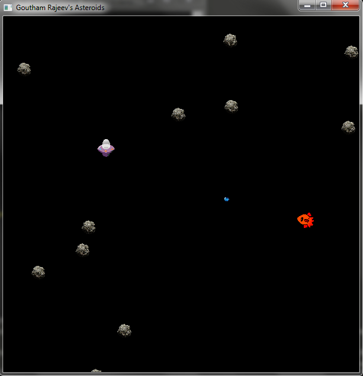

# Asteroids #
My version of the classic arcade game.

# Dev Notes #
Uses the [SFML library](https://www.sfml-dev.org/).
The code was written for SFML 2.1 .
1. Download the version of [SFML 2.1](https://www.sfml-dev.org/download/sfml/2.1/) corresponding to the operating system and compiler version.
2. Add the SFML-2.1 directory under the project root directory. The directory structure should resemble this:    

        |---Asteroids
        |   |---Asteroids_1
        |   |---SFML-2.1
        |       |---bin
        |       |---include
        |       |   |---SFML
        |       |       |---Audio
        |       |       |---Graphics
        |       |       |---Network
        |       |       |---System
        |       |       |---Window
        |       |---lib